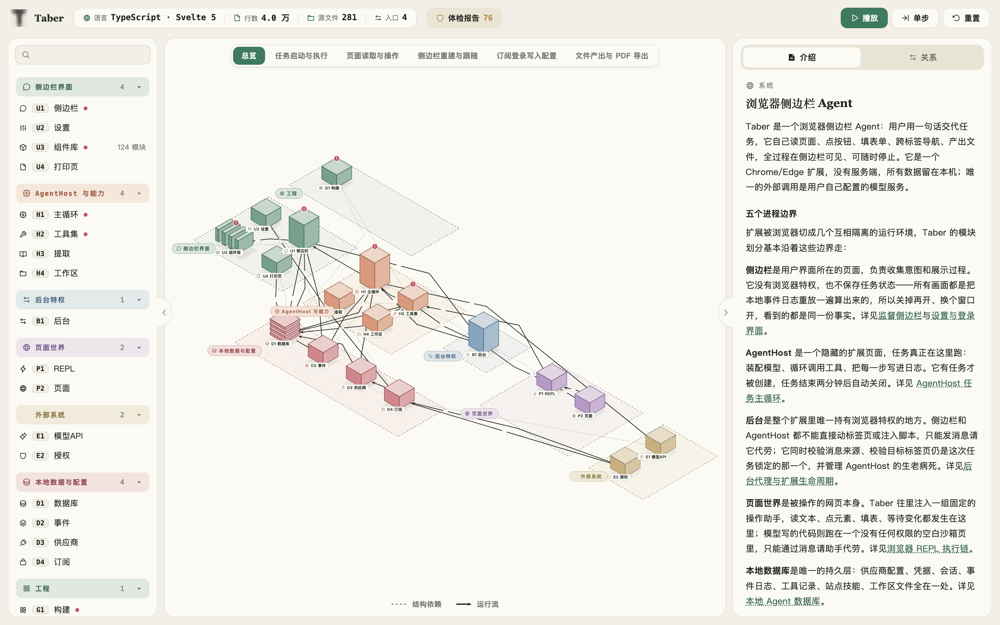
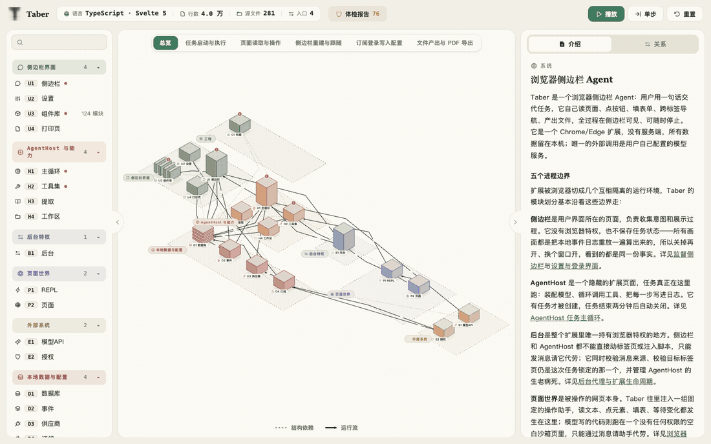
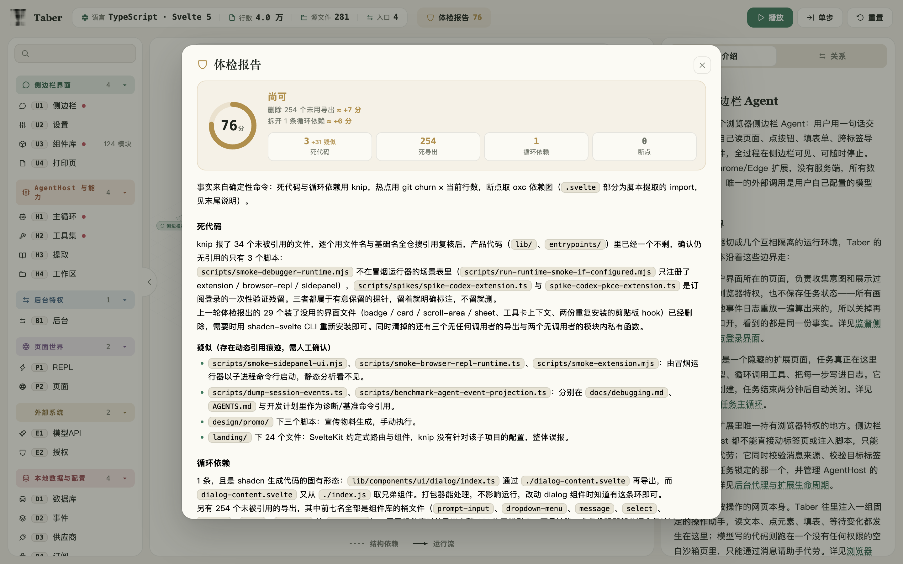

<div align="center">

# Architecture Wiki

**Retire your ARCHITECTURE.md: code changes surface instantly — how did architecture get this clear?**

[中文](./README.zh-CN.md) · [Live Demo (Chinese)](https://suge8.github.io/architecture-wiki/demo/)



</div>

Install this skill and your coding agent builds and maintains `docs/architecture/` for any repo. One document, three consumers:

- **Humans** open a webpage: an isometric city map, call chains played back entry by entry, one plain-language page per module — no Markdown digging.
- **AI** reads the wiki: every claim carries source files, content hashes and anchored symbols, so an agent understands the project on first read.
- **The repo** wires it into lint/CI: when code changes, `verify.mjs` names the stale page and shows the diff — syncing no longer relies on discipline.

<div align="center">

</div>

## Full-repo health check

Building the wiki also runs a full-repo checkup: files nobody imports, dependency cycles, big files that change all the time, broken imports — found in one pass. Every tool finding is reviewed before it enters the report, so false positives don't cry wolf. Troubled modules wear a badge on the map that jumps straight to the matching section.

<div align="center">

</div>

## How it works

Every claim in the wiki carries its receipts: which file it cites, which function it names, recorded with a content fingerprint — change the file or delete the function and it gets caught. The webpage is just a rendering of the wiki; delete it and rebuild anytime. Staleness isn't left to the AI's discipline: a tiny zero-dependency script (node + git) does the watching, while the AI does the understanding and rewriting.

## Install

Paste this to your agent:

```text
Install the skills from https://github.com/Suge8/architecture-wiki
```

## Usage

The skill is invoked explicitly (a heavyweight workflow, not auto-triggered). Tell your agent:

```text
Use architecture-wiki to build an architecture wiki for this repo
```

After code evolves, or when verify fails in CI:

```text
Use architecture-wiki to sync the architecture wiki
```

Requires Node.js 18+ and git; JS/TS dependency graphs additionally need bun or npm.

## Language support

| Language | Dependency graph | Status |
| --- | --- | --- |
| JS / TS | built-in oxc code-map | battle-tested |
| Go | `go list -json` | command-table support |
| Rust | `cargo metadata` | command-table support |
| Java / Kotlin | `jdeps` | command-table support |
| Others | agent reads code, verify guards sources | fallback path |

## Language

Chinese and English variants both ship in this repo; the installing agent picks one by your conversation language, and the generated pages follow ([ADR 0001](docs/adr/0001-bilingual-variants.md)).

## License

[Apache-2.0](./LICENSE); inlined [Phosphor Icons](https://phosphoricons.com) are MIT (see [NOTICE](./NOTICE)).
